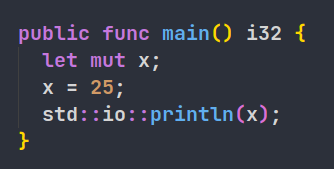

# Snowball
*A fast, high-level programming language 🐱*

Snowball provides a high-level, easy-to-use syntax for writing fast, efficient code. It is designed to be **easy to learn and use**, while still providing the performance of a low-level language.

 
 

### Fast and modern

* Statically Typed
* Fast compile and execution times
* Memory Safety
* High-Level constructs
* Cute mascot
* Many more things!